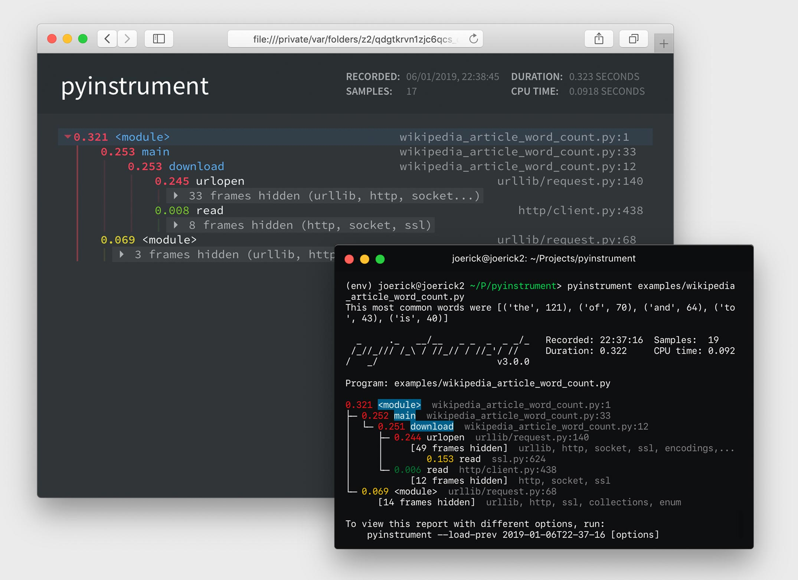

pyinstrument
============

A Python profiler that records the call stack of the executing code, instead
of just the final function in it.

[](https://raw.githubusercontent.com/joerick/pyinstrument/master/screenshot.jpg)

It uses a **statistical profiler**, meaning the code samples the stack
periodically (every 1 ms). This is lower overhead than event-
based profiling (as done by `profile` and `cProfile`).

This module is still very young, so I'd love any feedback/bug reports/pull
requests!

Documentation
-------------

* [Installation](#installation)
* [Usage](#usage)
  * [Command-line](#command-line)
  * [Django](#django)
  * [Python](#python)
* [Signal or setprofile mode?](#signal-or-setprofile-mode)
* [Known issues](#known-issues)
* [Changelog](#changelog)
  * [What's new in v0.13](#whats-new-in-v013)
  * [What's new in v0.12](#whats-new-in-v012)
* [Further information](#further-information)
  * [Call stack profiling?](#call-stack-profiling)

Installation
------------

    pip install -e git+https://github.com/joerick/pyinstrument.git#egg=pyinstrument

pyinstrument supports Python 2.7 and 3.3+.

Usage
-----

#### Command-line ####

You can call pyinstrument directly from the command line.

    python -m pyinstrument [options] myscript.py [args...]
    
    Options:
      -h, --help            show this help message and exit
      --setprofile          run in setprofile mode, instead of signal mode
      --html                output HTML instead of text
      -o OUTFILE, --outfile=OUTFILE
                            save report to <outfile>
      --unicode             force unicode text output
      --no-unicode          force ascii text output
      --color               force ansi color text output
      --no-color            force no color text output


This will run `myscript.py` to completion or until you interrupt it, and 
then output the call tree.

#### Django ####
    
Add `pyinstrument.middleware.ProfilerMiddleware` to `MIDDLEWARE_CLASSES`.
If you want to profile your middleware as well as your view (you probably
do) then put it at the start of the list.

##### Per-request profiling #####

Add `?profile` to the end of the request URL to activate the profiler. 
Instead of seeing the output of your view, pyinstrument renders an HTML
call tree for the view (as in the screenshot above).

##### Using `PYINSTRUMENT_PROFILE_DIR` #####

If you're writing an API, it's not easy to change the URL when you want
to profile something. In this case, add 
`PYINSTRUMENT_PROFILE_DIR = 'profiles'` to your settings.py.
pyinstrument will profile every request and save the HTML output to the
folder `profiles` in your working directory.

#### Python ####

```python
from pyinstrument import Profiler

profiler = Profiler() # or Profiler(use_signal=False), see below
profiler.start()

# code you want to profile

profiler.stop()

print(profiler.output_text(unicode=True, color=True))
```

You can omit the `unicode` and `color` flags if your output/terminal does
not support them.

Signal or setprofile mode?
--------------------------

On Mac/Linux/Unix, pyinstrument can run in 'signal' mode. This uses 
OS-provided signals to interrupt the process every 1ms and record the stack. 
It gives much lower overhead (and thus accurate) readings than the standard
Python [`sys.setprofile`][setprofile] style profilers. However, this can
only profile the main thread.

On Windows and on multi-threaded applications, a `setprofile` mode is
available by passing `use_signal=False` to the Profiler constructor. It works
exactly the same as the signal mode, but has higher overhead. See the below
table for an example of the amount of overhead.

[setprofile]: https://docs.python.org/2/library/sys.html#sys.setprofile

This overhead is important because code that makes a lot of Python function
calls will appear to take longer than code that does not.

                           | Django template render × 4000 | Overhead
---------------------------|------------------------------:|---------:
Base                       |                         1.46s | 
                           |                               |
pyinstrument (signal)      |                         1.84s |      26%
cProfile                   |                         2.18s |      49%
pyinstrument (setprofile)  |                         5.33s |     365%
profile                    |                        25.39s |    1739%

To run in setprofile mode:

* Use flag `--setprofile` if using the command-line interface
* Use setting `PYINSTRUMENT_USE_SIGNAL = False` in Django
* Use argument `use_signal=False` in the constructor for the Python API

Known issues
------------

-   When profiling Django, I'd recommend disabling django-debug-toolbar,
    django-devserver etc., as their instrumentation distort timings.
    
-   In signal mode, any calls to [`time.sleep`][pysleep] will return
    immediately. This is because of an implementation detail of `time.sleep`,
    but matches the behaviour of the C function [`sleep`][csleep].

-   Some system calls can fail with `IOError` when being profiled in signal
    mode. If this happens to you, your only option is to run in setprofile 
    mode.

[pysleep]: https://docs.python.org/2/library/time.html#time.sleep
[csleep]: http://pubs.opengroup.org/onlinepubs/009695399/functions/sleep.html

Changelog
---------

### What's new in v0.13 ###

-   `pyinstrument` command. You can now profile python scripts from the shell
    by running `$ pyinstrument script.py`. This is now equivalent to 
    `python -m pyinstrument`. Thanks @asmeurer!

### What's new in v0.12 ###

-   Application code is highlighted in HTML traces to make it easier to spot

-   Added `PYINSTRUMENT_PROFILE_DIR` option to the Django interface, which 
    will log profiles of all requests to a file the specified folder. Useful
    for profiling API calls.
    
-   Added `PYINSTRUMENT_USE_SIGNAL` option to the Django interface, for use
    when signal mode presents problems.

Further information
===================

Call stack profiling?
---------------------

The standard Python profilers [`profile`][1] and [`cProfile`][2] produce
output where time is totalled according to the time spent in each function.
This is great, but it falls down when you profile code where most time is
spent in framework code that you're not familiar with.

[1]: http://docs.python.org/2/library/profile.html#module-profile
[2]: http://docs.python.org/2/library/profile.html#module-cProfile

Here's an example of profile output when using Django.

    151940 function calls (147672 primitive calls) in 1.696 seconds

       Ordered by: cumulative time

       ncalls  tottime  percall  cumtime  percall filename:lineno(function)
            1    0.000    0.000    1.696    1.696 profile:0(<code object <module> at 0x1053d6a30, file "./manage.py", line 2>)
            1    0.001    0.001    1.693    1.693 manage.py:2(<module>)
            1    0.000    0.000    1.586    1.586 __init__.py:394(execute_from_command_line)
            1    0.000    0.000    1.586    1.586 __init__.py:350(execute)
            1    0.000    0.000    1.142    1.142 __init__.py:254(fetch_command)
           43    0.013    0.000    1.124    0.026 __init__.py:1(<module>)
          388    0.008    0.000    1.062    0.003 re.py:226(_compile)
          158    0.005    0.000    1.048    0.007 sre_compile.py:496(compile)
            1    0.001    0.001    1.042    1.042 __init__.py:78(get_commands)
          153    0.001    0.000    1.036    0.007 re.py:188(compile)
      106/102    0.001    0.000    1.030    0.010 __init__.py:52(__getattr__)
            1    0.000    0.000    1.029    1.029 __init__.py:31(_setup)
            1    0.000    0.000    1.021    1.021 __init__.py:57(_configure_logging)
            2    0.002    0.001    1.011    0.505 log.py:1(<module>)


When you're using big frameworks like Django, it's very hard to understand how
your own code relates to these traces.

Pyinstrument records the entire stack, so tracking expensive calls is much
easier.
