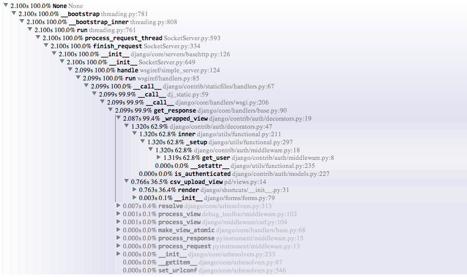

pyinstrument
============

A Python profiler that records the call stack of the executing code, instead
of just the final function in it. 

**The current version's profiling overhead is too large to trust the results
from it. I'd like to improve this, and am accepting pull requests.**

Installation
------------

    pip install -e git+https://github.com/joerick/pyinstrument.git#egg=pyinstrument

Usage
-----

-   **Django**
    
    Add `pyinstrument.middleware.ProfilerMiddleware` to `MIDDLEWARE_CLASSES`.

-   **Stand-alone**

        from pyinstrument import Profiler

        profiler = Profiler()
        profiler.start()

        # code you want to profile

        profiler.stop()

        print(profiler.as_text())

Why?
----

The standard Python profilers [`profile`][1] and [`cProfile`][2] produce
output where time is totalled according to the time spent in each function.
This is great, but it falls down when you profile code where most time is
spent in framework code that you're not familiar with.

[1]: http://docs.python.org/2/library/profile.html#module-profile
[2]: http://docs.python.org/2/library/profile.html#module-cProfile

Here's an example of profile output when using Django.

    151940 function calls (147672 primitive calls) in 1.696 seconds

       Ordered by: cumulative time

       ncalls  tottime  percall  cumtime  percall filename:lineno(function)
            1    0.000    0.000    1.696    1.696 profile:0(<code object <module> at 0x1053d6a30, file "./manage.py", line 2>)
            1    0.001    0.001    1.693    1.693 manage.py:2(<module>)
            1    0.000    0.000    1.586    1.586 __init__.py:394(execute_from_command_line)
            1    0.000    0.000    1.586    1.586 __init__.py:350(execute)
            1    0.000    0.000    1.142    1.142 __init__.py:254(fetch_command)
           43    0.013    0.000    1.124    0.026 __init__.py:1(<module>)
          388    0.008    0.000    1.062    0.003 re.py:226(_compile)
          158    0.005    0.000    1.048    0.007 sre_compile.py:496(compile)
            1    0.001    0.001    1.042    1.042 __init__.py:78(get_commands)
          153    0.001    0.000    1.036    0.007 re.py:188(compile)
      106/102    0.001    0.000    1.030    0.010 __init__.py:52(__getattr__)
            1    0.000    0.000    1.029    1.029 __init__.py:31(_setup)
            1    0.000    0.000    1.021    1.021 __init__.py:57(_configure_logging)
            2    0.002    0.001    1.011    0.505 log.py:1(<module>)

When you're using big frameworks like Django, it's very hard to understand how
your own code relates to these traces.

Pyinstrument records the entire stack each time a function is called, so
tracking expensive calls is much easier.
