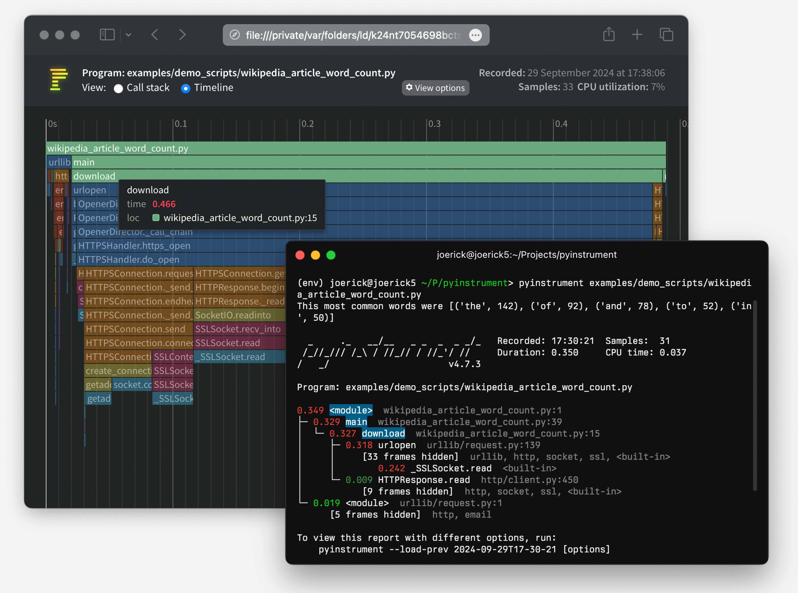

pyinstrument
============

[](https://badge.fury.io/py/pyinstrument)
[](https://github.com/joerick/pyinstrument/actions/workflows/test.yml)
[](https://github.com/joerick/pyinstrument/actions/workflows/wheels.yml)

[Documentation](https://pyinstrument.readthedocs.io/)

<!-- MARK intro start -->

[](https://raw.githubusercontent.com/joerick/pyinstrument/main/docs/img/screenshot.jpg)

Pyinstrument is a Python profiler. A profiler is a tool to help you optimize
your code - make it faster. To get the biggest speed increase you should
[focus on the slowest part of your program](https://en.wikipedia.org/wiki/Amdahl%27s_law).
Pyinstrument helps you find it!

> ☕️ Not sure where to start? Check out this [video tutorial from calmcode.io](https://calmcode.io/pyinstrument/introduction.html)!

<!-- MARK intro end -->

Installation
------------

<!-- MARK installation start -->

    pip install pyinstrument

Pyinstrument supports Python 3.7+.

<!-- MARK installation end -->

> To run Pyinstrument from a git checkout, there's a build step.
Take a look at [Contributing](#contributing) for more info.

Documentation
-------------

To learn how to use pyinstrument, or to check the reference, head to the
[documentation](https://pyinstrument.readthedocs.io/).

Known issues
------------

- Profiling code inside a Docker container can cause some strange results,
  because the gettimeofday syscall that pyinstrument uses is slow in that
  environment. See [#83](https://github.com/joerick/pyinstrument/issues/83)
- When using `pyinstrument script.py` where `script.py` contains a class
  serialized with `pickle`, you might encounter errors because the
  serialisation machinery doesn't know where `__main__` is. [See this issue
  for workarounds](https://github.com/joerick/pyinstrument/issues/109#issuecomment-722276263)

Changelog
---------

### v4.5.1

_22 July 2023_

-   Fix a bug that caused `[X frames hidden]` in the output when frames were deleted due to `__tracebackhide__` (#255)
-   Fix a bug causing built-in code to display the filepath `None` in the console output (#254)
-   Some docs improvements (#251)

### v4.5.0

_5 June 2023_

-   Adds a flat mode to the console renderer, which can be enabled by passing `-p flat` on the command line. This mode shows the heaviest frame as measured by self-time, which can be useful in some codebases. (#240)
-   Adds the ability to save `pstats` files. This is the file format used by cprofile in the stdlib. It's less detailed than pyinstrument profiles, but it's compatible with more tools. (#236)
-   Fixes a detail of the `--show-all` option - pyinstrument will no longer remove Python-internal frames when this option is supplied. (#239)
-   Internally to the HTML renderer, it now uses Svelte to render the frontend, meaning profile HTML files bundle less javascript and so are smaller. (#222)

### v4.4.0

_5 November 2022_

-   Adds the class name to methods in the console & HTML outputs (#203)
-   Fix a bug that caused pyinstrument machinery to appear at the start of a profile (#215)
-   Frames that set a `__traceback_hide__` local variable will now be removed from the output (#217)
-   Jupyter/IPython magic now supports async/await, if you run with a `--async_mode=enabled` flag. (#212)
-   Fix a crash when more than one root frame is captured in a thread - this can happen with gevent.
-   A big refactor to the backend, allowing more than just static information to be captured. This currently is just powering the class name feature, but more is to come!

### v4.3.0

_21 August 2022_

-   Adds buttons in the HTML output to switch between absolute and
    proportional (percentage) time.
-   Adds a command line flag `--interval` (seconds, default 0.001) to change the interval that
    pyinstrument samples a program. This is useful for long-running programs,
    where increasing the interval reduces the memory overhead.
-   Includes wheels for CPython 3.11.

### v4.2.0

-   Adds a command-line option `-p` `--render-option` that allows arbitrary
    setting of render options. This lets you set options like
    `filter_threshold` from the command line, by doing something like
    `pyinstrument -p processor_options.filter_threshold=0`.

    Here's the help output for the option:
    ```
      -p RENDER_OPTION, --render-option=RENDER_OPTION
                        options to pass to the renderer, in the format
                        'flag_name' or 'option_name=option_value'. For
                        example, to set the option 'time', pass '-p
                        time=percent_of_total'. To pass multiple options, use
                        the -p option multiple times. You can set processor
                        options using dot-syntax, like '-p
                        processor_options.filter_threshold=0'. option_value is
                        parsed as a JSON value or a string.
    ```
-   Adds the ability to view times in the console output as percentages,
    rather than absolute times. Use the ConsoleRenderer option
    `time='percent_of_total'`, or on the command line, use `-p`, like
    `pyinstrument -p time=percent_of_total`.
-   Adds command line options for loading and saving pyinstrument sessions.
    You can save the raw data for a pyinstrument session with `-r session`,
    like `pyinstrument -r session -o session.pyisession myscript.py`. Loading
    is via `--load`, e.g. `pyinstrument --load session.pyisession`.
-   Command line output format is inferred from the `-o` output file
    extension. So if you do `pyinstrument -o profile.html myscript.py`, you
    don't need to supply `-r html`, pyinstrument will automatically use the
    HTML renderer. Or if you do
    `pyinstrument -o profile.pyisession myscript.py`, it will save a raw
    session object.
-   Adds [usage examples for FastAPI and pytest](https://pyinstrument.readthedocs.io/en/latest/guide.html#profile-a-web-request-in-fastapi) to the documentation.
-   Fixes a bug causing NotImplementedError when using `async_mode=strict`.
-   Adds support for Python 3.11

### v4.1.1

-   Fixed an issue causing PYINSTRUMENT_PROFILE_DIR_RENDERER to output the
    wrong file extension when used with the speedscope renderer.

### v4.1.0

-   You can now use pyinstrument natively in an IPython notebook! Just use
    `%load_ext pyinstrument` at the top of your notebook, and then
    `%%pyinstrument` in the cell you want to profile.
-   Added support for the [speedscope](https://www.speedscope.app/) format.
    This provides a way to view interactive flamecharts using pyinstrument. To
    use, profile with `pyinstrument -r speedscope`, and upload to the
    speedscope web app.
-   You can now configure renderers for the Django middleware file output,
    using the `PYINSTRUMENT_PROFILE_DIR_RENDERER` option.
-   Added wheels for Linux aarch64 (64-bit ARM).

### v4.0.4

-   Fix a packaging issue where a package called 'test' was installed
    alongside pyinstrument
-   Use more modern C APIs to resolve deprecation warnings on Python 3.10.
-   Minor docs fixes

### v4.0.3

-   CPython 3.10 support
-   Improve error messages when trying to use Profiler from multiple threads
-   Fix crash when rendering sessions that contain a module in a FrameGroup

### v4.0.2

-   Fix some packaging issues

### v4.0.0

-   Async support! Pyinstrument now detects when an async task hits an await,
    and tracks time spent outside of the async context under this await.

    So, for example, here's a simple script with an async task that does a
    sleep:

    ```python
    import asyncio
    from pyinstrument import Profiler

    async def main():
        p = Profiler(async_mode='disabled')

        with p:
            print('Hello ...')
            await asyncio.sleep(1)
            print('... World!')

        p.print()

    asyncio.run(main())
    ```

    Before Pyinstrument 4.0.0, we'd see only time spent in the run loop, like
    this:

    ```
      _     ._   __/__   _ _  _  _ _/_   Recorded: 18:33:03  Samples:  2
     /_//_/// /_\ / //_// / //_'/ //     Duration: 1.006     CPU time: 0.001
    /   _/                      v3.4.2

    Program: examples/async_example_simple.py

    1.006 _run_once  asyncio/base_events.py:1784
    └─ 1.005 select  selectors.py:553
          [3 frames hidden]  selectors, <built-in>
             1.005 kqueue.control  <built-in>:0
    ```

    Now, with pyinstrument 4.0.0, we get:

          _     ._   __/__   _ _  _  _ _/_   Recorded: 18:30:43  Samples:  2
         /_//_/// /_\ / //_// / //_'/ //     Duration: 1.007     CPU time: 0.001
        /   _/                      v4.0.0

        Program: examples/async_example_simple.py

        1.006 main  async_example_simple.py:4
        └─ 1.005 sleep  asyncio/tasks.py:641
              [2 frames hidden]  asyncio
                 1.005 [await]

    For more information, check out the [async profiling documentation] and
    the [Profiler.async_mode] property.

-   Pyinstrument has a [documentation site], including full Python API docs!

[async profiling documentation]: https://pyinstrument.readthedocs.io/en/latest/how-it-works.html#async-profiling
[Profiler.async_mode]: https://pyinstrument.readthedocs.io/en/latest/reference.html#pyinstrument.Profiler.async_mode
[documentation site]: https://pyinstrument.readthedocs.io

### v3.4.2

- Fix a bug that caused `--show`, `--show-regex`, `--show-all` to be ignored
  on the command line.

### v3.4.1

- Under-the-hood modernisation

### v3.4.0

- Added `timeline` option (boolean) to Profiler methods `output_html()` and
  `open_in_browser()`.

### v3.3.0

- Fixed issue with `pyinstrument -m module`, where pyinstrument wouldn't find
  modules in the current directory.
- Dropped support for Python 2.7 and 3.5. Old versions will remain available
  on PyPI, and pip should choose the correct one automatically.

### v3.2.0

- Added the ability to track time in C functions. Minor note - Pyinstrument
  will record time spent C functions as 'leaf' functions, due to a limitation
  in how Python records frames. `Python -> C -> Python` is recorded as
  `Python -> Python`, but `Python -> Python -> C` will be attributed correctly.
  (#103)

### v3.1.2

- Fix `<__array_function__ internals>` frames appearing as app code in reports

### v3.1.1

- Added support for timeline mode on HTML and JSON renderers
- Released as a tarball as well as a universal wheel

### v3.1.0

- Added PYINSTRUMENT_SHOW_CALLBACK option on the Django middleware to
  add a condition to showing the profile (could be used to run pyinstrument
  on a live server!)
- Fixed bug in the Django middleware where file would not be written because
  of a unicode error

### v3.0.3

- Fixed bug with the Django middleware on Windows where profiling would fail
  because we were trying to put an illegal character '?' in the profile path.
  (#66)

### v3.0.2

- Add `--show` and `--show-regex` options, to mark certain files to be
  displayed. This helps to profile inside specific modules, while hiding
  others. For example, `pyinstrument --show '*/sympy/*' script.py`.

### v3.0.1

- Fix #60: pass all arguments after -m module_name to the called module
- Fix crash during HTML/JSON output when no frames were captured.

### v3.0.0

- Pyinstrument will now hide traces through libraries that you're using by default. So instead of showing you loads of frames going through the internals of something external e.g. urllib, it lets you focus on your code.

    | Before | After |
    | --- | ---
    |  |  |

  To go back to the old behaviour, use `--show-all` on the command line.

- 'Entry' frames of hidden groups are shown, so you know which call is the problem
- Really slow frames in the groups are shown too, e.g. the 'read' call on the socket
- Application code is highlighted in the console
- Additional metrics are shown at the top of the trace - timestamp, number of samples, duration, CPU time
- Hidden code is controlled by the `--hide` or `--hide-regex` options - matching on the path of the code files.
  ```
    --hide=EXPR           glob-style pattern matching the file paths whose
                          frames to hide. Defaults to '*/lib/*'.
    --hide-regex=REGEX    regex matching the file paths whose frames to hide.
                          Useful if --hide doesn't give enough control.
  ```

- Outputting a timeline is supported from the command line.

  ```
    -t, --timeline        render as a timeline - preserve ordering and don't
                          condense repeated calls
  ```

- Because there are a few rendering options now, you can load a previous profiling session using `--load-prev` - pyinstrument keeps the last 10 sessions.

- Hidden groups can also call back into application code, that looks like this:

    

- (internal) When recording timelines, frame trees are completely linear now, allowing
  for the creation of super-accurate frame charts.

- (internal) The HTML renderer has been rewritten as a Vue.js app. All the console improvements apply to the HTML output too, plus it's interactive.

- (internal) A lot of unit and integration tests added!

Yikes! See #49 for the gory details. I hope you like it.

### v2.3.0

-   Big refactor!
    -   `Recorders` have been removed. The frame recording is now internal to the `Profiler` object.
        This means the 'frame' objects are more general-purpose, which paves the way for...
    -   Processors! These are functions that mutate the tree to sculpt the output.
        They are used by the renderers to filter the output to the correct form. Now, instead of
        a time-aggregating recorder, the profiler just uses timeline-style recording (this is
        lower-overhead anyway) and the aggregation is done as a processing step.
    -   The upshot of this is that it's now way easier to alter the tree to filter stuff out, and
        do more advanced things like combining frames that we don't care about. More features to
        come that use this in v3.0!
-   Importlib frames are removed - you won't see them at all. Their children are retained, so
    imports are just transparent.
-   Django profile file name is now limited to a hundred of characters (#50)
-   Fix bug with --html option (#53)
-   Add `--version` command line option

### v2.2.1

-   Fix crash when using on the command line.

### v2.2.0

-   Added support for JSON output. Use `pyinstrument --renderer=json scriptfile.py`.
    [PR](https://github.com/joerick/pyinstrument/pull/46)
-   [@iddan](https://github.com/iddan) has put together an
    [interactive viewer](https://python-flame-chart.netlify.com/) using the JSON output!

    

-   When running `pyinstrument --html` and you don't pipe the output to a file, pyinstrument will write the console output to a temp file and open that in a browser.

### v2.1.0

-   Added support for running modules with pyinstrument via the command line. The new syntax
    is the `-m` flag e.g. `pyinstrument -m module_name`! [PR](https://github.com/joerick/pyinstrument/pull/45#pullrequestreview-143383557)

### v2.0.4

-   Fix crashes due to multi-threaded use of pyinstrument. The fix is in the C extension,
    over at https://github.com/joerick/pyinstrument_cext/pull/3

### v2.0.3

-   Pyinstrument can now be used in a `with` block.

    For example:

		profiler = pyinstrument.Profiler()
		with profiler:
		    # do some work here...
		print(profiler.output_text())
-   Middleware fix for older versions of Django

### v2.0.2

-   Fix for max recursion error when used to profile programs with a lot of frames on the stack.

### v2.0.1

-   Ensure license is included in the sdist.

### v2.0.0

-   **Pyinstrument uses a new profiling mode**. Rather than using
    signals, pyintrument uses a new statistical profiler built on
    PyEval_SetProfile. This means no more main thread restriction, no more
    IO errors when using Pyinstrument, and no need for a separate more
    'setprofile' mode!

-   **Renderers**. Users can customize Pyinstrument to use alternative renderers
    with the `renderer` argument on `Profiler.output()`, or using the `--renderer`
    argument on the command line.

-   **Recorders**. To support other use cases of Pyinstrument (e.g. flame charts),
    pyinstrument now has a 'timeline' recorder mode. This mode records captured
    frames in a linear way, so the program execution can be viewed on a
    timeline.

### v0.13

-   `pyinstrument` command. You can now profile python scripts from the shell
    by running `$ pyinstrument script.py`. This is now equivalent to
    `python -m pyinstrument`. Thanks @asmeurer!

### v0.12

-   Application code is highlighted in HTML traces to make it easier to spot

-   Added `PYINSTRUMENT_PROFILE_DIR` option to the Django interface, which
    will log profiles of all requests to a file the specified folder. Useful
    for profiling API calls.

-   Added `PYINSTRUMENT_USE_SIGNAL` option to the Django interface, for use
    when signal mode presents problems.

Contributing
------------

To setup a dev environment:

    virtualenv --python=python3 env
    . env/bin/activate
    pip install --upgrade pip
    pip install -r requirements-dev.txt
    pre-commit install --install-hooks

To get some sample output:

    pyinstrument examples/wikipedia_article_word_count.py

To run the tests:

    pytest

To run linting checks locally:

    pre-commit run --all-files

Some of the pre-commit checks, like `isort` or `black`, will auto-fix
the problems they find. So if the above command returns an error, try
running it again, it might succeed the second time :)

Running all the checks can be slow, so you can also run checks
individually, e.g., to format source code that fails `isort` or `black`
checks:

    pre-commit run --all-files isort
    pre-commit run --all-files black

To diagnose why `pyright` checks are failing:

    pre-commit run --all-files pyright

### The HTML renderer Vue.js app

The HTML renderer works by embedding a JSON representation of the sample with
a Javascript 'bundle' inside an HTML file that can be viewed in any web
browser.

To edit the html renderer style, do:

    cd html_renderer
    npm ci
    npm run serve

When launched without a top-level `window.profileSession` object, it will
fetch a sample profile so you can work with it.

To compile the JS app and bundle it back into the pyinstrument python tool:

    bin/build_js_bundle.py [--force]
