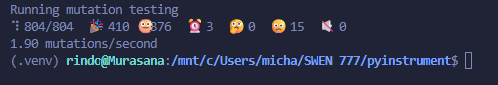

# Mutation Test for Pyinstrument

This folder contains the tests cases specifically designed to kill the mutant tests generated by the mutation testing tool mutmut for the pyinstrument project. These tests verify the core functionalities of pyinstrument and ensure robustness by catching potential bugs introduced by code mutations.

By running these mutation killing tests, we guarantee that the test suite is strong enough to detect subtle bugs and changes, thus improving the overall quality and reliability of the codebase.

## How to run these tests
Make sure you have this library installed:

```pip install pytest```

```pip install pytest-cov```

```pip install mutmut```

Install all this in your enviroment (venv is recomended).
1. Position yourself in the root of the project
2. From the root run this to see that all the tests are passing:

```
pytest
```

3. From the root run this other command to see the mutants stats:

```
mutmut run
```

We are going to describe the three symbols from left to right:
- 410 mutants killed - This means that our tests caught and failed these mutants.
- 376 survived mutants - These passed all tests, which mean that we need stronger and more specific tests to kill these mutants
- 3 timeouts - These tests took too long with these mutants; possibly long running or stuck code

