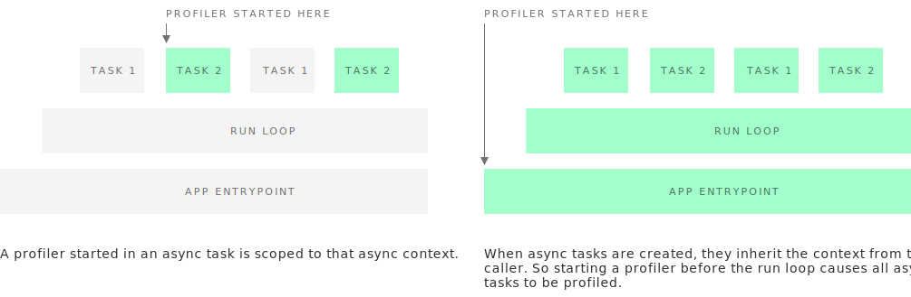

How it works
============

Pyinstrument interrupts the program every 1ms[^interval] and records the entire stack at
that point. It does this using a C extension and `PyEval_SetProfile`, but only
taking readings every 1ms. Check out [this blog post](http://joerick.me/posts/2017/12/15/pyinstrument-20/) for more info.

[^interval]: Or, your configured ``interval``.

You might be surprised at how few samples make up a report, but don't worry,
it won't decrease accuracy. The default interval of 1ms is a lower bound for
recording a stackframe, but if there is a long time spent in a single function
call, it will be recorded at the end of that call. So effectively those
samples were 'bunched up' and recorded at the end.

## Statistical profiling (not tracing)

Pyinstrument is a statistical profiler - it doesn't track every
function call that your program makes. Instead, it's recording the call stack
every 1ms.

That gives some advantages over other profilers. Firstly, statistical
profilers are much lower-overhead than tracing profilers.

|              | Django template render × 4000                      | Overhead
| -------------|:---------------------------------------------------|---------:
| Base         | `████████████████                       `  0.33s   |
|              |                                                    |
| pyinstrument | `████████████████████                   `  0.43s   |      30%
| cProfile     | `█████████████████████████████          `  0.61s   |      84%
| profile      | `██████████████████████████████████...██`  6.79s   |    2057%

But low overhead is also important because it can distort the results. When
using a tracing profiler, code that makes a lot of Python function calls
invokes the profiler a lot, making it slower. This distorts the
results, and might lead you to optimise the wrong part of your program!

## Full-stack recording

The standard Python profilers [`profile`][1] and [`cProfile`][2] show you a
big list of functions, ordered by the time spent in each function.
This is great, but it can be difficult to interpret _why_ those functions are
getting called. It's more helpful to know why those functions are called, and
which parts of user code were involved.

[1]: http://docs.python.org/2/library/profile.html#module-profile
[2]: http://docs.python.org/2/library/profile.html#module-cProfile

For example, let's say I want to figure out why a web request in Django is
slow. If I use cProfile, I might get this:

    151940 function calls (147672 primitive calls) in 1.696 seconds

       Ordered by: cumulative time

       ncalls  tottime  percall  cumtime  percall filename:lineno(function)
            1    0.000    0.000    1.696    1.696 profile:0(<code object <module> at 0x1053d6a30, file "./manage.py", line 2>)
            1    0.001    0.001    1.693    1.693 manage.py:2(<module>)
            1    0.000    0.000    1.586    1.586 __init__.py:394(execute_from_command_line)
            1    0.000    0.000    1.586    1.586 __init__.py:350(execute)
            1    0.000    0.000    1.142    1.142 __init__.py:254(fetch_command)
           43    0.013    0.000    1.124    0.026 __init__.py:1(<module>)
          388    0.008    0.000    1.062    0.003 re.py:226(_compile)
          158    0.005    0.000    1.048    0.007 sre_compile.py:496(compile)
            1    0.001    0.001    1.042    1.042 __init__.py:78(get_commands)
          153    0.001    0.000    1.036    0.007 re.py:188(compile)
      106/102    0.001    0.000    1.030    0.010 __init__.py:52(__getattr__)
            1    0.000    0.000    1.029    1.029 __init__.py:31(_setup)
            1    0.000    0.000    1.021    1.021 __init__.py:57(_configure_logging)
            2    0.002    0.001    1.011    0.505 log.py:1(<module>)

It's often hard to understand how your own code relates to these traces.

Pyinstrument records the entire stack, so tracking expensive calls is much
easier. It also hides library frames by default, letting you focus on your
app/module is affecting performance.

```
  _     ._   __/__   _ _  _  _ _/_   Recorded: 14:53:35  Samples:  131
 /_//_/// /_\ / //_// / //_'/ //    Duration: 3.131     CPU time: 0.195
/   _/                    v3.0.0b3

Program: examples/django_example/manage.py runserver --nothreading --noreload

3.131 <module>  manage.py:2
└─ 3.118 execute_from_command_line  django/core/management/__init__.py:378
      [473 frames hidden]  django, socketserver, selectors, wsgi...
         2.836 select  selectors.py:365
         0.126 _get_response  django/core/handlers/base.py:96
         └─ 0.126 hello_world  django_example/views.py:4
```

## 'Wall-clock' time (not CPU time)

Pyinstrument records duration using 'wall-clock' time. When you're writing a
program that downloads data, reads files, and talks to databases, all that
time is *included* in the tracked time by pyinstrument.

That's really important when debugging performance problems, since Python is
often used as a 'glue' language between other services. The problem might not
be in your program, but you should still be able to find why it's slow.

## Async profiling

pyinstrument can profile async programs that use `async` and `await`. This
async support works by tracking the 'context' of execution, as provided by the
built-in [contextvars] module.

[contextvars]: https://docs.python.org/3/library/contextvars.html

When you start a Profiler with the {py:attr}`async_mode <pyinstrument.Profiler.async_mode>` `enabled` or `strict` (not `disabled`), that Profiler is attached to the current async context.

When profiling, pyinstrument keeps an eye on the context. When execution exits
the context, it captures the `await` stack that caused the context to exit.
Any time spent outside the context is attributed to the that halted execution
of the `await`.

Async contexts are inherited, so tasks started when a profiler is active are
also profiled.

<div class="spacer" style="height: 1em"></div>



pyinstrument supports async mode with Asyncio and Trio, other `async`/`await`
frameworks should work as long as they use [contextvars].

[Greenlet] doesn't use `async` and `await`, and alters the Python stack during
execution, so is not fully supported. However, because greenlet also supports
[contextvars], we can limit profiling to one green thread, using `strict`
mode. In `strict` mode, whenever your green thread is halted the time will be
tracked in an `<out-of-context>` frame. Alternatively, if you want to see
what's happening when your green thread is halted, you can use
`async_mode='disabled'` - just be aware that readouts might be misleading if
multiple tasks are running concurrently.

[greenlet]: https://pypi.org/project/greenlet/
